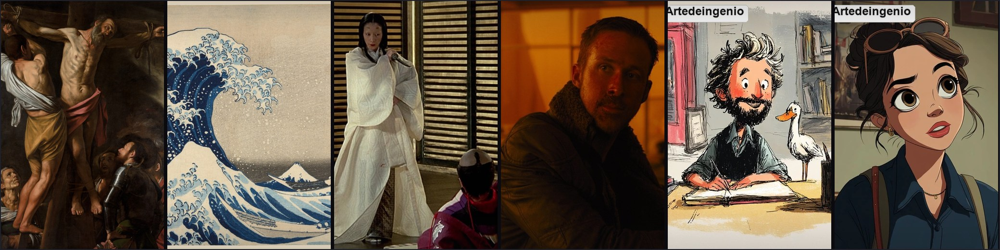
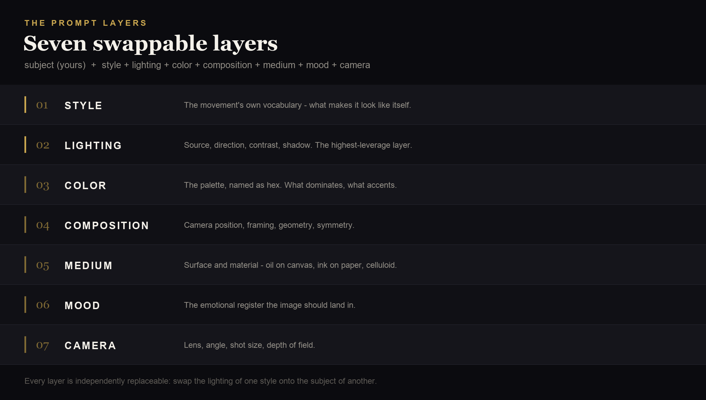
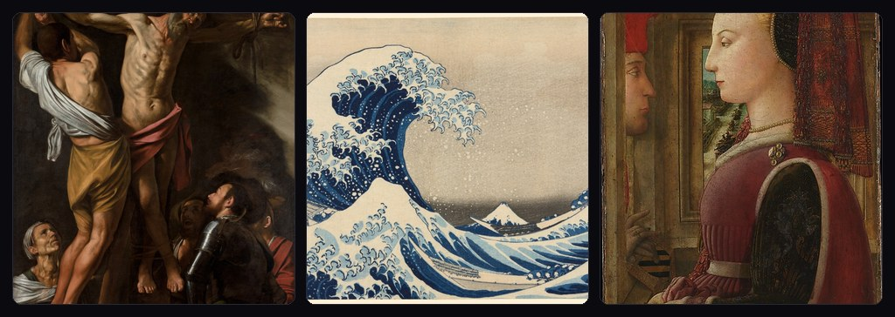
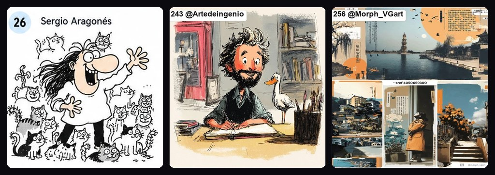
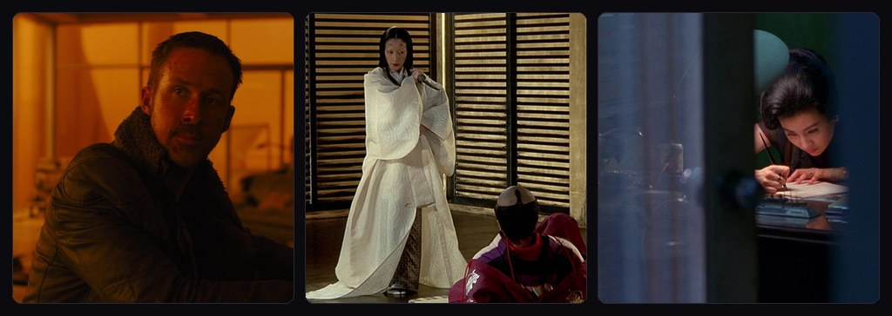
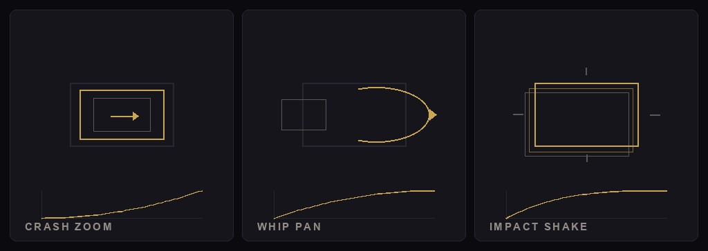
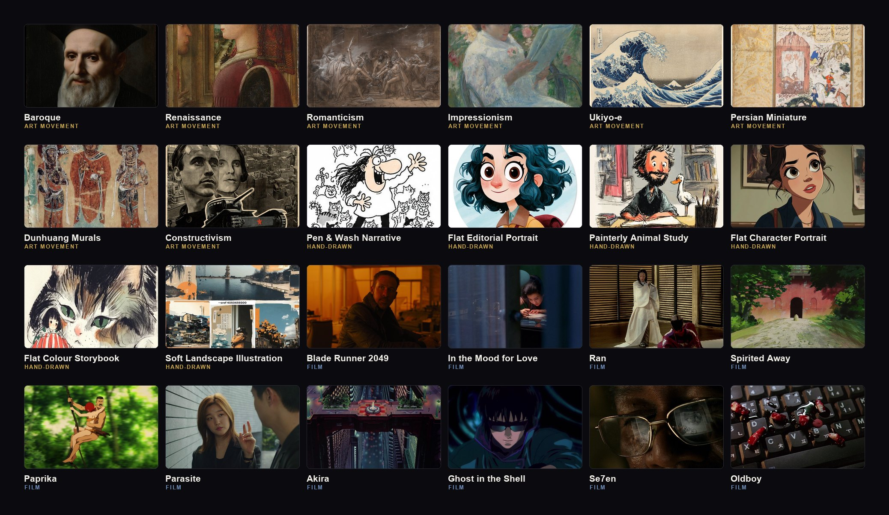

<div align="center">



# 芸術美学スタイル庫

**「視覚スタイル」を、そのまま呼び出せるプロンプト層に分解する**

画派 · 手描き · 監督 · カメラワーク —— 4 つの軸、1 つの構造

[](https://github.com/deepseek-ai/deepseek-harness)
[](.repo/skill)
[](LICENSE)

`421 流派` · `274 手描きスタイル` · `100 本の映画` · `157 枚のショットレシピ` · `686 本のノート` · `746 枚の画像`

[中文](README.md) ｜ [English](README.en.md) ｜ [Français](README.fr.md) ｜ **日本語**

</div>

---

## これは何か

多くの人は「スタイルの参考」を画像を保存することで集めます。数百枚たまっても、
いざ使うときには何を見ればいいのか、どう言葉にすればいいのか分かりません。
画像は動きません。

この庫はやり方を変えます：**それぞれの視覚言語を、独立に差し替えられる 7 つの層に分解する。**



層に分けてはじめて、A の光を B の主体に載せられます。
**それこそが参考庫の本当の用途です。**

```bash
python3 artvault.py compose \
  "雨のネオン街の賞金稼ぎ、バロックの光、サイバーパンクの構図" \
  --subject "a female bounty hunter in a wet neon alley"
```

「バロック」の直後が「光」ならバロックのライティング層を、「サイバーパンク」なら
スタイル層と構図層を取ります。出力は層に分かれたポジティブプロンプト、ネガティブ
プロンプト、配色、動画層、そして**衝突解決の記録**です。

> **同じ主体のまま、どの層でも単独で差し替えられます。**
> これが「スタイル語の寄せ集め」との決定的な違いです。

---

## 4 つの軸

4 つの軸は同じカード構造と同じ 7 層の語彙を共有しているので、軸をまたいで
混ぜられます —— 映画の光 + 画派の配色 + 手描きの素材。

| | 軸 · 規模 | 何に答えるか |
|---|---|---|
|  | **画派スタイル · 421**<br>（7 大分類） | ビザンティンから Y2K まで、浮世絵からサイバーパンクまで。流派ごとに 1 枚：6 軸の視覚分解 + 7 層プロンプト + 6 色配色 + 専用ネガティブ + 動画層<br>`python3 artvault.py layers 巴洛克` |
|  | **手描きスタイル · 274**<br>（A〜H の 8 群） | 絵本、風刺漫画、現代イラスト、国風……[handraw-style](https://github.com/yang0/handraw-style)（**MIT**）から丸ごと取り込み。カードは中国語名、上流の番号は別名として保持<br>`python3 artvault.py layers 极端比例弯曲绘本` |
|  | **監督と映画 · 100**<br>（44 人の監督） | 「どんな見た目か」だけでなく「誰がどう撮ったか」。監督 → 映画の順に整理：代表フレーム + 6 軸分解 + 7 層プロンプト + 配色 + 動画層、さらに **6142 件のスチル外部リンク**（索引のみ、転載なし）<br>`python3 artvault.py film show dune` |
|  | **ショットレシピ · 157**<br>（10 類） | 最初の 3 軸は「どんな見た目か」に答えます。この軸は「**その動きをどう作るか**」に答えます。フレーム数・イージング・振幅をパラメータ表にし、既知の落とし穴を添えます。[video-shotcraft](https://github.com/Vincentwei1021/video-shotcraft)（**Apache-2.0**、本庫は分類と整形のみ）<br>`python3 artvault.py shots show crash-zoom-punch` |

> ⚠ **ショットカードに色彩・ライティング欄が無いのは意図的です。** 扱うのは
> フレーム数とイージング（`zoom 6f ease-in、1→2.6`）で、7 層に当てはめるには
> 創作するしかありません。だから独自の 4 項目で並べ、**`compose` の層解決には
> あえて参加しません** —— この境界はテストで守っています。

---

## 規模



| | 数 |
|---|---|
| **流派カード** | **421 枚**（7 大分類）。各カードに 6 軸の視覚分解 + 7 層プロンプト + 配色 + 動画層 |
| **実画像** | **746 枚**（167 MB）：パブリックドメイン実画像 **452 枚** + handraw-style 番号参考図 **294 枚**（MIT）。359 流派に画像あり |
| **手描きカードの中国語名** | **274 / 274** に命名済み（うち 249 枚は `traits` からの逐語抽出、25 枚は `traits` が空のため英語生成名からの逆訳） |
| **ガイドと方法論** | 15 本（流派総覧、キーワード図譜、7 層の方法、動画構造、配色早見…） |
| **キーワード図譜** | 最も混同しやすい **4 組**の概念、**46 個**の同義表現。どれで検索しても同じカードに着地 |
| **映画スタイルカード** | **100 本**（44 人の監督）：監督 → 映画の順に整理。各カードにスチル索引 + 6 軸分解 + 7 層プロンプト + 配色 + 動画層、さらに **6142 件のスチル外部リンク**（索引のみ、転載なし） |
| **ショットレシピカード** | **157 枚**（10 類）：カメラワークとモーションの技、パラメータ表（フレーム/イージング/振幅）と既知の落とし穴付き。[Vincentwei1021/video-shotcraft](https://github.com/Vincentwei1021/video-shotcraft) より、**Apache-2.0、本庫は分類と整形のみ** |
| **ノートテンプレート** | 3 個 |
| **スクリプト** | 65 本（取得・生成・検索・プロンプト合成・MCP サーバー） |

> **62 流派は「プロンプトのみのカード」です。** 抽象表現主義、ポップアート、
> ミニマリズム、概念芸術、サイバーパンク、ヴェイパーウェイヴ —— これらは自由に
> 再配布できる実画像がほとんど存在しません。視覚言語と 7 層は通常どおり分解し、
> 画像だけを付けていません。これは意図した設計で、欠落ではありません。

---

## 使い方

### 1. Obsidian の保管庫として読む

このフォルダを Obsidian で開きます。次の順で入るのがおすすめです：

1. `00-guides/提示词拆解方法.md` —— **まずこれ**。7 層の仕組みを理解する
2. `00-guides/流派总览.md` —— 全流派の総合入口
3. `10-movements/` —— 好きな流派を選び、完全な分解を読む
4. `00-guides/关键词图谱.md` —— 未知のスタイル用語を後で引く

### 2. AI に直接呼ばせる

本庫は人向けの Markdown だけでなく、**機械向けのインターフェース**も持ちます：

```bash
cd .repo

python3 artvault.py categories              # 7 大分類
python3 artvault.py search "ネオン 雨夜"      # あいまい検索（中国語・英語）
python3 artvault.py search "抑圧的だが華麗な光" --semantic
python3 artvault.py layers 巴洛克            # 7 層だけ（最もトークンが少ない）
python3 artvault.py show 浮世絵              # カード全体
python3 artvault.py palette 赛博朋克         # 6 色の配色
python3 artvault.py related 立体主义         # 近い流派を探す

python3 artvault.py film list               # 100 本の映画
python3 artvault.py shots search "急推 衝撃"  # 「何をしたいか」から技を探す

python3 artvault.py --json layers 巴洛克     # 機械可読
```

**中核は組み合わせです**：

```bash
# 自然言語、自動で層に分ける
python3 artvault.py compose "雨のネオンの賞金稼ぎ、バロックの光" --subject "a bounty hunter"

# 明示指定、時代をまたぐ
python3 artvault.py compose --style ukiyo-e --lighting baroque \
  --color vaporwave --composition precisionism --subject "a lone samurai"

# 軸をまたぐ：映画の光 + 画派の配色
python3 artvault.py compose --lighting villeneuve-dune --color baroque \
  --subject "a lone figure on a dune"
```

**層の衝突は自動で解決します。** 流派を混ぜるとネガティブ語がぶつかります ——
浮世絵は `cast shadows` を禁じ、バロックの光は `deep crushed shadows` を要求する。
精度主義は `people` を禁じるのに、主体は人物である。
**モデルはエラーを出しません**。ただ「なぜか出図が悪い」という、極めて
原因を追いにくい形で現れます。そこでぶつかったネガティブ語は**ネガティブ
プロンプトから自動的に外し**、「自動解決した衝突」に何を外し、何に譲ったかを
一行ずつ書きます。規則は一行で：**ポジティブは意図、ネガティブはガードレール、
ガードレールは意図に譲る。** 生の合算を自分で判断したいときは `--keep-conflicts`。

### 3. AI skill として入れる（推奨）

リポジトリには skill が 2 つ付属します。入れると、**skill に対応した任意の AI
アシスタント**が視覚・美的なタスクで本庫を参照するようになり、記憶から流派用語を
でっち上げなくなります。

```bash
cd .repo/skill && ./install.sh
```

| skill | 役割 | 発動するとき |
|---|---|---|
| `art-aesthetic-vault` | 庫を**使う**：流派検索、7 層の取得、流派をまたいだ合成 | 「このキャラはどのスタイル？」と聞いたとき |
| `build-art-aesthetic-vault` | 庫を**作る**：ゼロから 1 セット構築 | 「同じような庫が欲しい」と言ったとき |

> [!note] なぜ skill がデータを同梱しないのか
> どちらも本リポジトリへの**シンボリックリンク**です —— データはリポジトリの
> 1 部だけ。`mv_*.py`（流派定義）を skill に梱包すると 2 部になり、必ず分岐します。
> 実測済み：梱包版は 4 ファイルがリポジトリと同期しておらず、それで作った庫は
> 分類が誤っていました。

見つかった skill ディレクトリすべてにリンクを作ります：

| ディレクトリ | 読むもの |
|---|---|
| `~/.agents/skills/` | DSH / Codex / 汎用規約 |
| `~/.claude/skills/` | Claude Code |
| `~/.codex/skills/` | Codex |

**なぜシンボリックリンクか**：skill は `pwd -P` で自身の実体位置を解決し、そこから
リポジトリ根を推定できます —— **リポジトリがどこにあり、移動しても自動で見つかり**、
設定は一切不要です。

```bash
.repo/skill/install.sh --copy        # コピーで導入（移動したら再導入が必要）
.repo/skill/install.sh --uninstall   # アンインストール
bash .repo/skill/locate.sh           # 手動でリポジトリを特定（調査用）
```

反映されるのは**新しく開始した AI セッション**です。

### 4. MCP で接続（Claude Desktop / Cursor）

```json
{
  "mcpServers": {
    "artvault": {
      "command": "python3",
      "args": ["<本リポジトリの絶対パス>/.repo/mcp_server.py"]
    }
  }
}
```

16 個のツールを公開します：`search_movements` `get_movement` `get_layers`
`compose_prompt` `get_palette` `find_related` `list_categories` `analyze_image`
`match_movement` `get_video_prompt`、映画庫から `search_films` `get_film`
`get_film_layers` `get_film_stills`、ショット庫から `search_shots` `get_shot`。
後半のいくつかは Pillow / CLIP モデルが必要です。条件が満たされない場合は理由を
説明し、前半の 7 つには影響しません。

---

## 何が違うのか

### 1. 画像パックではなく、組み合わせ可能な構造

画像パックは「どんな感じか」を渡します。本庫は「どうやってその感じを作るか」を渡します。
どの層も単独で取り出して再利用できます。主体を替えてスタイル層を残せば、
それはスタイル転写のテンプレートです。

### 2. ライティングが独立した層になっている

多くの人はプロンプトをひと塊で書き、試行錯誤で調整します。本庫は明言します：
**最終的な質感に効くのは、スタイル語そのものより光である。**
各流派のライティング層は独立した一区切りで、他の主題にそのまま載せられます。

### 3. 軸ごとに「専用のネガティブ語」がある

**その流派**の典型的な失敗に狙いを定めたもので、汎用のネガティブ一覧ではありません：

- 印象派 → `black shadows, smooth blending, photorealistic`
- ルネサンス → `visible brushstrokes, impasto`（AI は油彩に厚塗りを足しがち）
- 浮世絵 → `3d shading, cast shadows, gradient`（AI は立体感を足しがち）

**流派が違えばネガティブ語はしばしば正反対**です —— だから混ぜるとぶつかり、
本庫がそれを管理します。

### 4. AI が使える。人が眺めるだけではない

大規模言語モデルの芸術流派の記憶は曖昧で、アール・ヌーヴォーとアール・デコ、
バルビゾン派と印象派をよく混同します。本庫は流派ごとの具体用語を固定するので、
AI が呼び出しても作り話をしません。

### 5. 用語は打ち込まれている。でっち上げではない

キーワード図譜は最も混同しやすい **4 組** —— 前衛、現代、ポストモダン、
シュルレアリスム —— を選びます。各組に定義 1 つ、「それは何ではないか」という
境界をいくつか、そして **46 個**の同義表現。どれで検索しても同じカードに
着地します。

### 6. 手元の 1 枚も、そのまま動画プロンプトになる

カード上の動画プロンプトは**汎用**で、主体の行はプレースホルダです。しかし実際に
やりたいのは「この画像を動かす」ことでしょう：

```bash
python3 i2v_prompt.py あなたの画像.jpg --slug baroque
```

主体のショットサイズ、画面内の位置、画面内の運動方向、光を動かすか、カメラを
押すか流すか —— すべて**その画像の客観測定**（顔によるショットサイズ / 顕著性
中心 / 線の方向 / 細部密度 / 明暗構造）から導き、「導出根拠」を添えて検証できる
ようにします。それでも「誰が、何をしているかは一言だけ自分で補ってください」
は残します —— 見ている人だけが知っていることで、スクリプトは代わりに作りません。

### 7. 数字は現算。書き込みではない

README にある「本庫に何がどれだけあるか」という数字はすべて、`publish_stats()` が
**公開ビュー**（作者のマシンにあるものではなく、git が追跡しているもの）に対して
現算し、`verify_vault.py` が一行ずつ照合します。書き込んだ数字の唯一の効能は、
いつか間違いになることです —— 本庫はそれで痛い目を見たので、錠をかけました。

---

## 3 つの原則

1. **少なさより、誤りの無さ。**
   選定では意図的に「少し緩めて足す」をしません —— 画像が 1 枚の流派は 1 枚のままです。
   参考庫の本当の敵は画像の少なさではなく、誤った画像です。誤った参考は直感を汚し、
   しかも自分では気づけません。

2. **スタイル語より光。**
   調整できる層が 1 つだけなら、光を調整する。

3. **記憶から流派用語をでっち上げない。**
   大規模言語モデルの流派の記憶は曖昧で、近い画派を混同します。庫の具体用語に従う。

---

<details>
<summary><b>完全なスキルツリーを開く（421 流派 / 7 大分類）</b></summary>

Art Aesthetic Style Library
│
├─ Western Classical & Modern · 48
│  ├─ Medieval & Byzantine
│  │  ├ Byzantine Art . Romanesque . Gothic Art
│  │  └ International Gothic
│  ├─ Renaissance
│  │  ├ Early Renaissance . Renaissance . Early Netherlandish
│  │  └ Venetian School . Mannerism
│  ├─ Baroque & Classical
│  │  ├ Baroque . Caravaggisti . Dutch Golden Age
│  │  └ Rococo . Classicism . Neoclassicism
│  ├─ 19th Century
│  │  ├ Romanticism . Realism . Naturalism
│  │  └ Orientalism . Academic Art . Pre-Raphaelite
│  ├─ Impressionism & After
│  │  ├ Impressionism . Neo-Impressionism . Post-Impressionism
│  │  └ Les Nabis . Symbolism . Japonism
│  ├─ Fin de Siecle
│  │  └ Art Nouveau . Vienna Secession . Arts and Crafts
│  ├─ American & Modern Schools
│  │  ├ Hudson River School . Luminism . Tonalism
│  │  ├ Ashcan School . American Realism . Regionalism
│  │  ├ Precisionism . Social Realism . Socialist Realism
│  │  ├ Muralism . Magic Realism . Metaphysical Art
│  │  ├ Neo-Romanticism . Naïve Art (Primitivism) . Classical Realism
│  │  └ Kitsch . New Objectivity
│  └─ Others
│      └ Biedermeier
├─ East Asia · South Asia · Islam · 21
│  ├─ China
│  │  ├ Blue-Green Landscape . Ink Wash Xieyi . Gongbi
│  │  └ Song Academic Painting . Dunhuang Murals
│  ├─ Japan
│  │  ├ Ukiyo-e . Rimpa . Suiboku-ga
│  │  ├ Yamato-e . Sōsaku-hanga . Shin-hanga
│  │  └ Zen Art
│  ├─ Korea
│  │  └ Minhwa
│  ├─ Persia & Islam
│  │  ├ Persian Miniature . Safavid Painting . Mughal Miniature
│  │  └ Islamic Geometric . Arabic Calligraphy
│  ├─ Himalaya & Indigenous
│  │  └ Tibetan Thangka . Indigenism
│  └─ Others
│      └ Native Art
├─ Modernism & Post-war · 24
│  ├─ Expressionism & Fauvism
│  │  └ Expressionism . Fauvism . Der Blaue Reiter
│  ├─ Cubism & Futurism
│  │  └ Cubism . Orphism . Futurism
│  ├─ Geometric Abstraction
│  │  ├ Suprematism . Constructivism . De Stijl
│  │  └ Bauhaus
│  ├─ Dada & Surrealism
│  │  └ Dada . Surrealism
│  ├─ Post-war Abstraction
│  │  └ Abstract Expressionism . Color Field
│  ├─ Pop & Minimal
│  │  ├ Pop Art . Op Art . Minimalism
│  │  └ Art Deco
│  └─ Others
│      ├ Conceptual Art . Photorealism . Land Art
│      └ Superflat . Neo-Expressionism . Cubo-Futurism
├─ Digital · Subculture · Photography · 25
│  ├─ Five Punks
│  │  ├ Cyberpunk . Steampunk . Dieselpunk
│  │  └ Solarpunk . Biopunk
│  ├─ Internet Nostalgia
│  │  ├ Vaporwave . Synthwave . Pixel Art
│  │  └ Retro 90s Anime . Dreamcore . Y2K Aesthetic
│  ├─ Animation & Illustration
│  │  └ Anime Cel
│  ├─ Silver & Print
│  │  └ Cyanotype . Wet Plate Collodion . Polaroid & Film
│  ├─ Atmosphere & Living
│  │  ├ Dark Academia . Cottagecore . Wabi-Sabi
│  │  └ Gothic Subculture . Wasteland
│  ├─ Graphic Design
│  │  └ Minimalist Design . Swiss Style . Memphis Design
│  ├─ Cinematic
│  │  └ Film Noir
│  └─ Others
│      └ Fantasy Art
├─ Avant-Garde · Contemporary · Postmodern · 23
│  ├─ The Three Umbrellas
│  │  └ Avant-Garde . Contemporary Art . Postmodernism
│  ├─ Abstract Branches
│  │  └ Abstract Art . Hard-Edge Painting . Post-Painterly Abstraction
│  ├─ Anti-Art & Kitsch
│  │  └ Neo-Dada . Neo-Pop . Transavantgarde
│  ├─ Margins & Body
│  │  └ Art Brut . Outsider Art . Feminist Art
│  ├─ Public & Space
│  │  └ Street Art . Kinetic Art . Light and Space
│  ├─ New Media & Post-Conceptual
│  │  └ Digital Art . Hyper-Realism
│  └─ Others
│      ├ Neo-Geo . Post-Minimalism . Spatialism
│      └ Art Informel . Tachisme . Lyrical Abstraction
├─ Photography & Image · 6
│  ├─ Two Traditions
│  │  └ Pictorialism . Straight Photography
│  ├─ Social & Street
│  │  └ Documentary Photography . Street Photography
│  └─ Conceptual & Fashion
│      └ Surrealist Photography . Fashion Editorial
└─ Hand-drawn Illustration Styles · 274
   ├─ International Editorial Cartoon / Humour
   │  └ 35 entries (see the category index)
   ├─ International Picture Book / Narrative
   │  ├ Loose Ink-and-Wash Storybook . Nordic Fine-Line Whimsy . Busy Anthropomorphic Everyday World
   │  ├ Warm Vintage Line-and-Wash . Crosshatched Wild Storybook . Bendy Absurd Storybook
   │  ├ Naturalist Watercolor Animal Storybook . Classic Pen-and-Light-Wash Storybook . Quirky Ink-and-Watercolor Tale
   │  ├ Minimal Poetic Picturebook Doodle . Bold Geometric Picturebook . Muted Deadpan Picturebook
   │  ├ Folk-Line Decorative Storybook . Dreamlike Surreal Storybook . Layered Vintage Storybook Collage
   │  ├ Expressive Character Sketch Cartoon . Dreamlike Clean-Line Sci-Fi Figure . European Clear-Line Adventure Figure
   │  └ Geometric European Clear-Line Figure
   ├─ Modern Graphic / Stylised Figures
   │  └ 28 entries (see the category index)
   ├─ Japanese Authors / Contemporary Illustration
   │  └ 41 entries (see the category index)
   ├─ Chinese Authors / Contemporary Illustration
   │  └ 31 entries (see the category index)
   ├─ General Web / Medium / Regional
   │  └ 46 entries (see the category index)
   ├─ New Additions / Chinese Contemporary
   │  ├ 可爱萌系插画风 . 诗意青春插画风 . 唯美漫画插画风
   │  ├ 水墨新国风插画 . 魔性幽默漫画风 . 都市生活漫画风
   │  ├ 极简温暖叙事风 . 东方美学商业插画 . 童趣水彩绘本风
   │  ├ 东方奇幻绘本风 . 清新文艺插画风 . 复古潮流插画风
   │  ├ 可爱萌系插画风 . 国风幻想插画风 . 治愈生活插画风
   │  └ 时尚女性插画风
   └─ Others
       └ 58 entries (see the category index)

</details>

---

## クレジットと出典

この庫が成り立つのは、**成果を開いてくれた人たち**がいるからです。以下のどれも
「参考にした」程度のものではなく、**丸ごと取り込み、同じカード構造に組み直した**
ものです：

| 出典 | 提供したもの | ライセンス |
|---|---|---|
| [yang0/handraw-style](https://github.com/yang0/handraw-style) | **274 個の手描きスタイル**と番号参考図。第 7 大分類を構成 | **MIT** |
| [Vincentwei1021/video-shotcraft](https://github.com/Vincentwei1021/video-shotcraft) | **157 枚のショットレシピカード**（10 類）。本庫は分類と整形のみ | **Apache-2.0** |
| [film-grab.com](https://film-grab.com/) | 映画スチルの索引。カードに埋め込んだ代表フレームの**著作権は各権利者に帰属** | サイト明記：*images are not permitted for commercial use*。個人の研究参考のみ |
| [Tate 芸術用語集](https://www.tate.org.uk/art/art-terms) | 各流派カードの「出典」節に挙げた用語定義ページ。7 層の記述は権威ある定義に遡れる | 用語の**著作権は Tate** に帰属。本庫は**出典として引用するのみ** |
| [クリーブランド美術館](https://openaccess-api.clevelandart.org) · [シカゴ美術館](https://api.artic.edu/docs/) · [メトロポリタン美術館](https://collectionapi.metmuseum.org) · [ウィキメディア・コモンズ](https://commons.wikimedia.org) | **452 枚のパブリックドメイン実画像** | **CC0 / パブリックドメイン** |

**はっきり書いておくべき 3 つの境界**：

1. **ショットカードは本庫のオリジナルではありません。** その 157 枚の技法
   記述の著作権は上流（Apache-2.0）に帰属します。本庫は分類と整形のみを行い、
   各カードに上流のパスと commit を記載しています。上流自身が明記しています：
   モーション手法は公開作品から研究したが、**実装はすべてゼロから書き直し**、
   原盤素材を一切含まない。そして「公開されていること」は**許諾とは違う**。
   特定作品の識別可能な全体の視聴覚的提示を再現するためにこれらのカードを
   使わないでください。
2. **映画スチルの著作権は各権利者に帰属します。** カードに埋め込んだ代表フレームは
   **個人の研究参考のみ**です。film-grab は商用利用不可と明記しています。再配布や
   商用の前にご自身で許諾を得てください。
3. **「参考作者 / スタイル名」は索引ラベルです** —— 作者本人の説明でも、模倣の
   指示でもありません。番号参考図は画風のみを取ります。図中の主体・構図・文字を
   一緒に持ってこないでください。

本庫自身の部分（7 層の分解、カード構造、CLI / MCP、検索と合成のロジック）は
MIT で公開します。

---

## ライセンス

- **コードとカード本文**：[MIT](LICENSE)
- **パブリックドメイン実画像**：CC0 / パブリックドメイン。出典とライセンスは各カードの「出典」節に記載
- **handraw-style 番号参考図**：MIT（上流）
- **ショットレシピカード**：Apache-2.0（上流）。本庫は分類と整形のみ
- **映画スチル**：著作権は各権利者に帰属。個人の研究参考のみ

---

<div align="center">

このライブラリが役に立ったら、Star ⭐ や PR での流派追加を歓迎します

</div>
